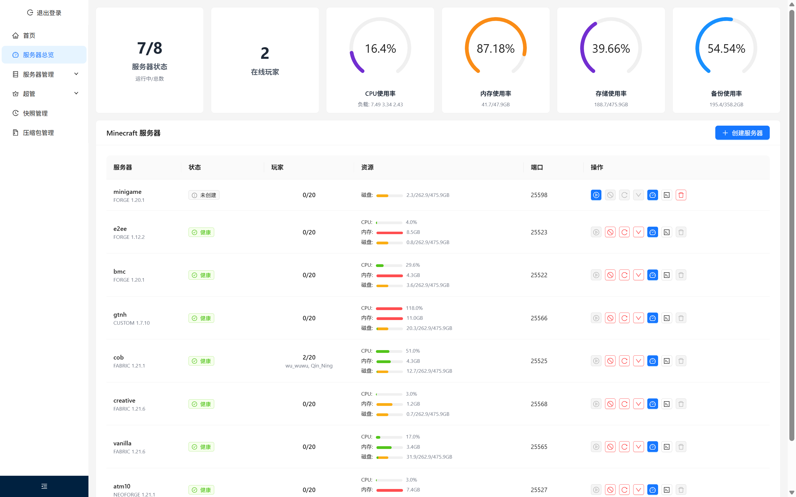
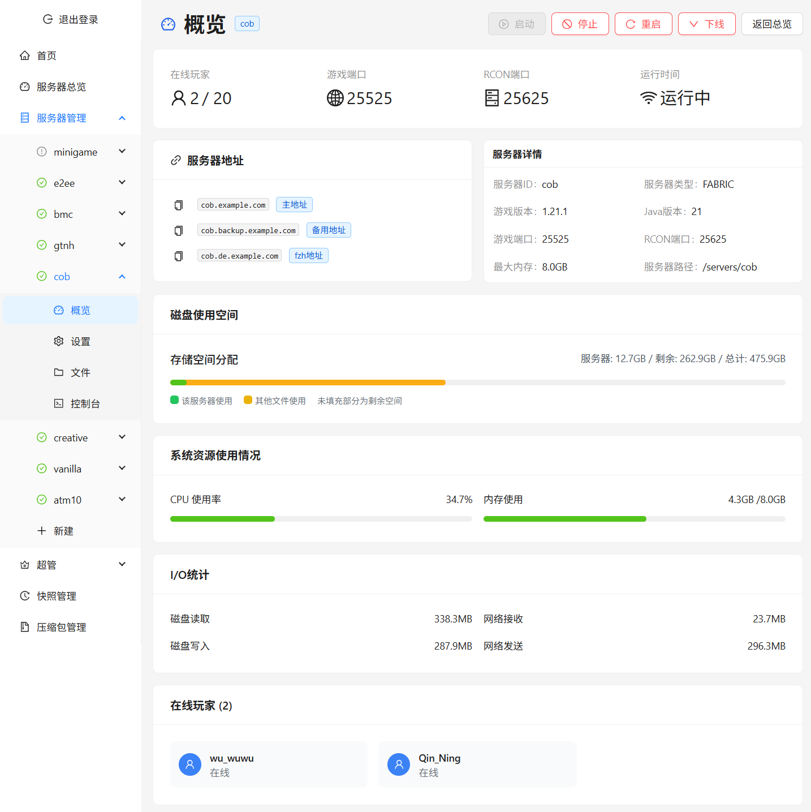
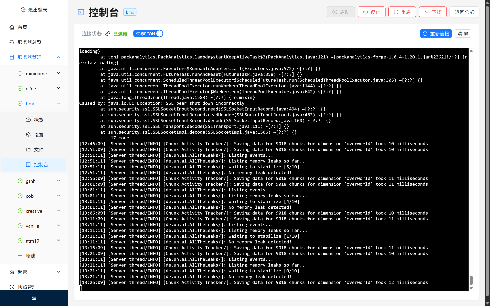
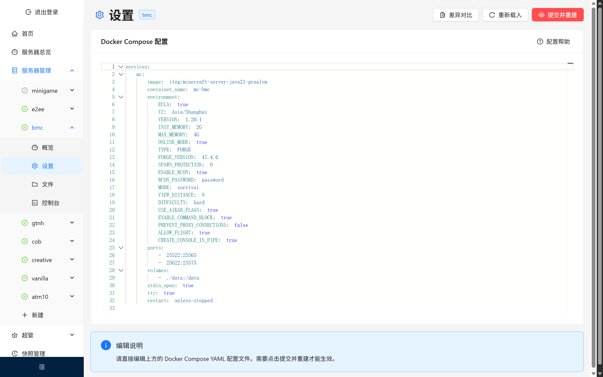
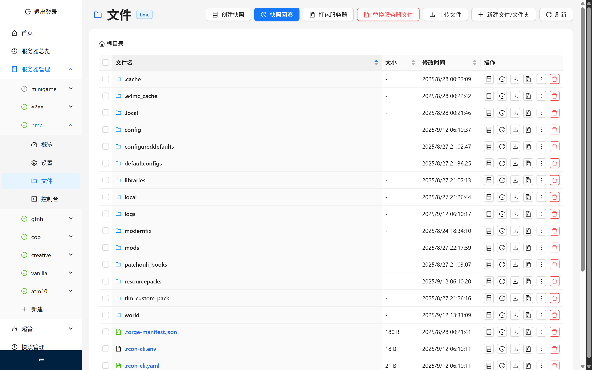
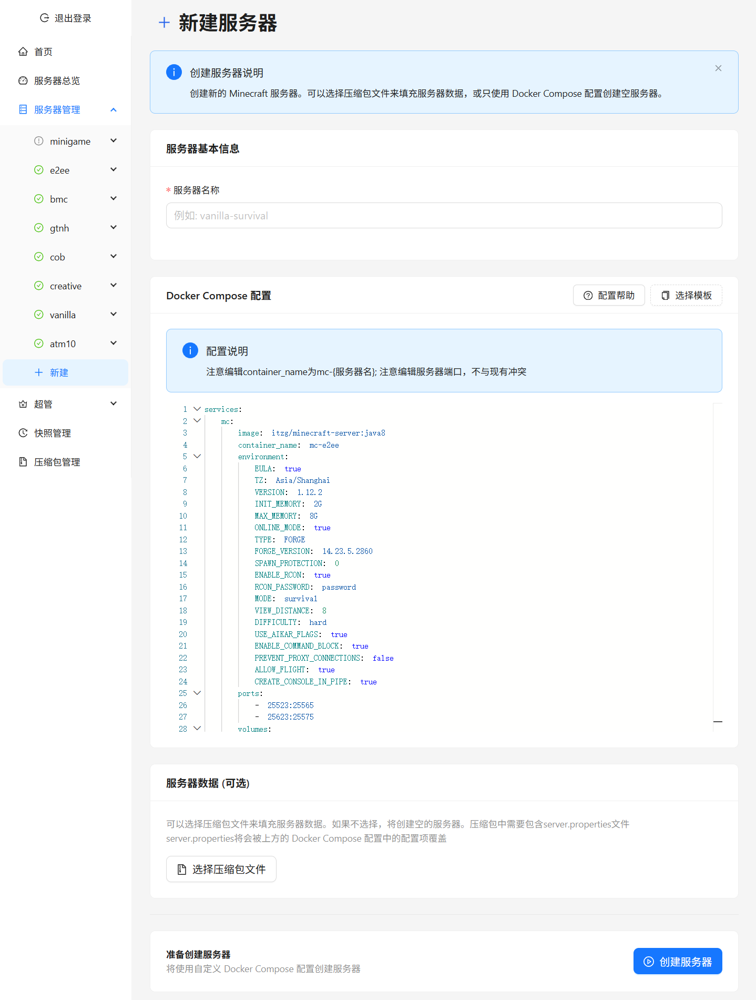
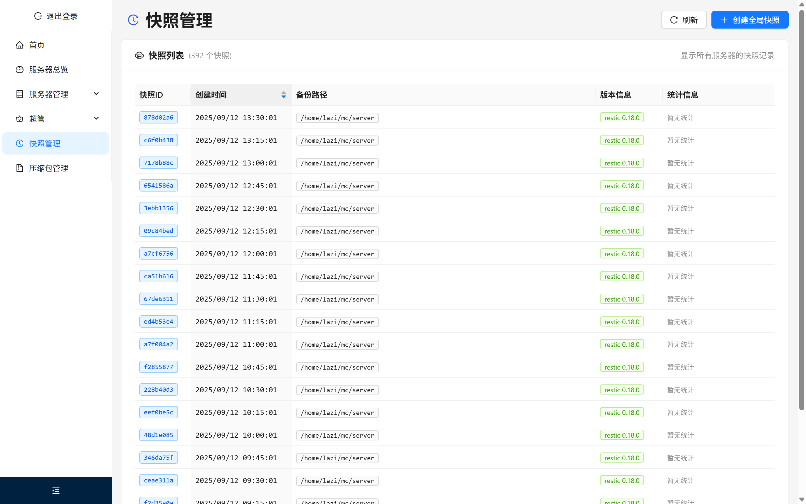
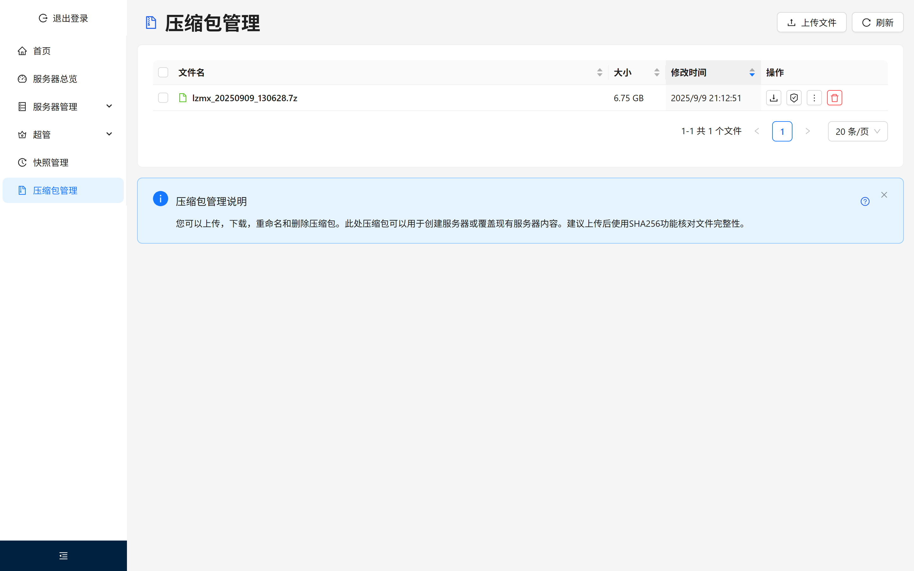

# MC-Admin

Minecraft 服务器管理平台，提供多服务器管理、实时监控、快照备份和智能DNS路由等功能。

## 功能特性

- 🖥️ 现代化 Web 界面，支持实时监控和操作
- 🐳 Docker 容器化部署，支持 Docker Compose 配置管理
- 📊 实时资源监控（CPU、内存、磁盘、网络）
- 💾 快照备份系统（基于 Restic）
- 🎮 实时控制台和命令执行
- 👥 用户权限管理和角色控制
- 🌐 智能 DNS 路由管理（支持多云厂商）

## 界面预览

### 仪表盘

### 服务器概览

### 实时控制台

### Docker Compose 配置

### 文件管理

### 创建服务器

### 快照管理

### 压缩包管理

## 开发计划

具体开发计划见[看板](https://github.com/users/xyqyear/projects/7)

- [x] 登录页面：密码登录和机器人登录
- [ ] 仪表盘页面
  - [x] 系统 CPU、内存和磁盘使用情况
  - [x] 总玩家数统计（从 mc-health 查询玩家数）
  - [ ] 组件检查（备份模组警告）
  - [x] 服务器列表、运行状态（已停止、已创建、运行中、暂停），玩家数
  - [x] 重启、启动、停止、停机、启动操作
- [x] 服务器管理页面
  - [x] 概览页面：控制台、在线玩家（同下），CPU 和内存使用情况（通过 Docker），磁盘空间使用情况（通过 du）
  - [x] 玩家列表（使用日志追踪和偶尔使用 RCON 同步。从 25565 端口查询的信息不可靠）
  - [x] Compose 文件管理页面
  - [x] 文件管理页面
    - [x] 基础文件管理
    - [x] 文件恢复：对于玩家文件，在玩家不在线时恢复；对于其他文件，要求停止服务器
    - [x] 打包和下载文件
  - [x] 创建新服务器页面
- [x] 快照管理页面
- [x] 压缩包管理页面
- [x] 超级管理员页面
  - [x] 用户管理页面
