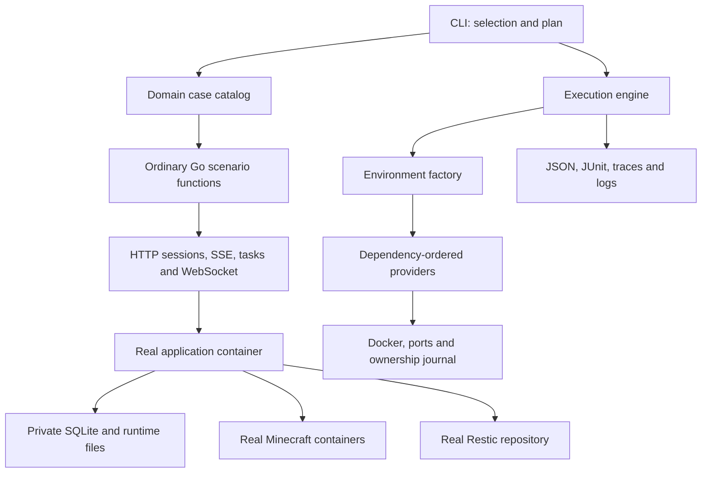

# API E2E architecture

## Boundaries

The application image is an input artifact. The runner provisions and observes deployed processes through Docker and public APIs. It does not import application code, mock backend services, inject a testing reset endpoint, or read the application's database to manufacture passing assertions.

| Package | Responsibility |
| --- | --- |
| `cmd/mc-admin-e2e` | CLI options, signals, preflight and final reporting |
| `internal/engine` | Catalog validation, deterministic grouping/sharding, workers, case lifecycle and reports |
| `internal/environment` | Provider graph, resource access, verification and reverse-order cleanup |
| `internal/platform` | Local Docker commands, host port leases, run locks and durable cleanup journal |
| `internal/api` | Network transport, cookies/CSRF, bounded polling, asynchronous protocol completion |
| `internal/evidence` | Redaction and bounded structured evidence |
| `internal/coverage` | Deployed API schema matching, response observations and complete shard/case accounting |
| `internal/fixtures` | MC Admin-specific providers and reusable data/session helpers |
| `suites/<domain>` | Feature assertions and domain-local helpers |

The dependency direction keeps the engine independent of MC Admin routes and feature names. Suites do not import each other. A shared helper belongs in `fixtures` only when multiple domains need it; a feature-specific operation stays beside its scenarios. HTTP wrappers preserve status codes and wire semantics instead of duplicating the backend's service layer.

## Environment composition

An `environment.Provider` has an ID, dependency IDs, `Setup`, and optional `Verify`. An `environment.Recipe` declares its providers and Minecraft slot requirement. The graph is validated before deployment for missing dependencies, duplicates, cycles and invalid budgets. A recipe ID refers to one definition in the catalog; changing its initial-state contract requires changing the definition/version, not silently reusing the same name for different setups.

| Recipe | Composition | Intended cases |
| --- | --- | --- |
| `backend-v1` | Backend, SQLite startup/migrations, owner/admin accounts, dynamic configuration baseline | Auth, registries, templates, configuration and events |
| `server-v1` | Backend + leased game/RCON ports + API-created stopped server | Files, archive and server management |
| `lifecycle-v1` | Stopped server + one reserved Minecraft slot | Cases that start/stop/remove their own real game server |
| `running-v1` | Stopped server + startup + healthy status and RCON verification | Observations that need an already running server |
| `backup-v1` | Stopped server + private initialized Restic repository | Snapshot and restoration scenarios |
| `world-v1` | Running server + private Restic repository | Actual mcmap rendering, world previews/restores and pruning |

Providers register cleanup immediately as resources are acquired, before any later operation can fail. Cleanup runs in reverse registration order and attempts all registered callbacks even if one returns an error or panics. A setup failure returns the partially built environment so the runner can capture diagnostics and reclaim it. Provider prerequisites and baseline creation are infrastructure; business actions whose behavior is under test belong in the scenario itself.

Every environment has a random identity and private directory. Its application container gets private configuration, JWT/master credentials, SQLite, archive storage, logs and process-local temporary directories. The server workspace is bound into the backend at the same absolute path visible to the Docker daemon, because the backend creates sibling game containers. Game container names and Compose projects incorporate the environment identity. Independent environments do not share writable worlds or databases.

Only immutable inputs, such as Docker layers and the compiled executable, are shared across runs. A warm mutable world, copied live database or cross-run backend pool is not part of this implementation. If future measurements justify caching game downloads or pristine worlds, add a content-addressed immutable artifact with private copies and an explicit validity contract.

## Isolation and reuse

Every `engine.Case` has a stable ID, suite, tags, recipe, timeout, ordinary `Run(context.Context, *engine.Scope) error` function, and an explicit isolation policy:

| Policy | Contract |
| --- | --- |
| `Fresh` | Provision for this case and destroy afterward. Use for global configuration, lifecycle changes, snapshots/restores, unknown side effects, or destructive operations. |
| `ObserveReuse` | Observe an existing environment without changing its declared business baseline. Session creation, access logs and harmless caches are allowed; provider verification must pass. |
| `CleanReuse` | Own all mutations, register compensation through `Scope.Cleanup`, and restore the declared baseline before provider verification. |

Fresh is the recommended starting policy, but it must still be written explicitly. Reusable recipes require `Verify` on every provider. The backend verifier checks readiness, the bootstrap user count, empty templates, expected server IDs, no active background tasks, and unchanged dynamic configuration. Server verification checks expected lifecycle state; a running server additionally answers RCON. Port verification relies on its still-held lease.

These checks are a narrow reuse contract, not proof that an arbitrary mutation has been undone. They do not reset audit/history rows, player data, archive content, every file, scheduler state or the JVM. The current reusable scenarios only read these environments or compensate template CRUD. New mutations outside this contract require `Fresh` or a provider with stronger cleanup and verification.

A worker exclusively owns its environment. Compatible reusable cases execute sequentially in one recipe-affinity group. An assertion, cleanup, verification or evidence failure retires the environment; the next case gets a new one. The framework never repairs a failed environment and reports the original case as passing. Each scenario must pass independently through `--case`, in shuffled order, and with `--no-reuse`. No scenario consumes a previous case's data or output.

## Execution and scheduling

The planner validates the complete catalog, sorts stable IDs, intersects selection filters, and groups reusable cases by recipe and fresh cases by ID. Groups are indivisible scheduling units. Historical costs come from the embedded `suites/costs.json`; the engine receives a generic cost profile without importing suite names. A missing case cost falls back to its recipe cost, then the positive profile default. Timing history influences placement only: it never determines which cases exist or are selected.

Deterministic allocation places Minecraft groups first, then other groups, in descending estimated worker cost with stable group-key ties. Each placement minimizes the greater of predicted worker work divided by the worker limit and Minecraft slot-seconds divided by the slot limit; ties prefer less Minecraft work, then less total work, then the lower shard index. Reuse group costs include all member cases. All shards of the same executable, selection, cost profile and capacity configuration cover every selected case exactly once. A large atomic group still limits balance; do not add feature-specific logic to the scheduler or weaken isolation to split it.

A seed shuffles group and within-group priority after assignment. `plan.json` records the selected catalog, per-case estimates and Minecraft requirements, all assignments, this shard's priority order, and the scheduling algorithm, cost-profile SHA-256 and capacity limits. Actual concurrent start order follows resource availability and completion; the recorded priority remains reproducible. `--no-reuse` changes environment allocation only, retaining group membership and shard assignment.

The dispatcher admits the first resource-ready group in seeded priority order. A group waiting for Minecraft capacity does not occupy a worker or prevent a later ordinary group from starting. Workers cap live environments; the dispatcher conservatively accounts for a group's declared Minecraft capacity through its final teardown, including no-reuse execution and failure-driven environment replacement. The factory still reserves actual environment capacity before setup and retains it until teardown. Its weighted reservation is serialized to avoid partial-acquisition deadlocks. Oversized groups fail explicitly without allocating environments. Cancellation preserves a failed result for every pending case and drains active groups through independent cleanup contexts. Budgets are local to a runner, so a shared host still needs suitable CI-level concurrency and capacity.

The lifecycle is capacity reservation → setup → case → case compensation → reuse verification → retirement/next case. Reservation uses the run deadline; the setup deadline starts after capacity is acquired. The engine retains the reservation until environment teardown finishes, including failed setup. Each stage has structured failure reporting. Setup and execution honor their respective context deadlines. Compensation, verification, diagnostic capture and teardown each receive an independent bounded context using the cleanup timeout, even after cancellation; diagnostic capture cannot exhaust teardown's budget. A phase returning nil after its deadline still fails. All network calls, subprocesses and polling must propagate context; a Go callback that ignores cancellation cannot be forcibly interrupted by the runner, so CI job timeouts remain the outer limit. Fatal HTTP errors stop polling; only an expected not-yet-ready state is retried. A failed scenario is never automatically rerun.

A failed, panicking or expired environment teardown cannot confirm that its containers are gone. Its factory reservation and dispatcher capacity remain held; the engine cancels the run before admitting replacements or further cases. Pending cases receive failed cancellation results carrying the teardown cause without waiting on the retained reservation. Already active groups honor cancellation and drain their own independent cleanup phases. The final journal recovery and workflow recovery step can still reclaim owned resources, but recovery does not erase the original teardown failure. Diagnostic capture failure alone does not imply retained resources: successful teardown releases capacity and independent cases can continue.

### Timing evidence and calibration

`Result.seconds` and the JUnit case duration measure the case execution envelope after dispatch, including reservation, setup, the complete scenario callback, cleanup, verification and retirement when applicable. Final reusable-group diagnostics and teardown are included in the last case. They are not pure assertion times. `Result.timings` records independently measured `reservation_seconds`, `setup_seconds`, `assertion_seconds`, `case_cleanup_seconds`, `verification_seconds`, `diagnostics_seconds` and `teardown_seconds`; small recorder/progress overhead remains only in the execution envelope. `assertion_seconds` includes every action and wait inside the case callback, whether or not it declares a `Scope.Step`.

`scheduler_queue_seconds` is the pre-dispatch group wait, while `scheduler_resource_wait_seconds` is its overlapping subset during which the declared Minecraft capacity was unavailable. Both are attributed once to the first case of the group; later members report zero scheduler wait because they execute inside the already admitted group. Neither queue field is included in `seconds`. Factory reservation time is measured separately inside execution. Summed case durations, phase durations and queue delays can overlap across workers and must not be treated as wall time.

The initial cost profile identifies successful runs 36148282102 and 36155392209. Its per-case estimate is the mean of each recorded duration minus the interval from case start to the first environment provider trace, with zero subtraction for reused cases. This removes reservation delay approximately, along with small recorder initialization overhead. Those source runners omitted final reusable-group teardown; their estimates remain suitable for atomic recipe groups but are not exact lifecycle measurements. Recipe fallback costs are the median observed active proxy per recipe, floored at 15 seconds; a new recipe uses 60 seconds.

Review weight updates from multiple successful runs using the precise phase fields. Exclude scheduler queue and factory reservation waits, retain setup/scenario/cleanup costs, aggregate reuse members before assessing their placement, and document source run URLs and measurement changes in the profile. Unknown and obsolete timing entries never change catalog discovery. The profile is compiled into the same candidate executable consumed by all shards, so no external mutable timing service or runtime override can produce different assignments within a qualification.

## Real API assertions

The bootstrap master token creates accounts through the administrative API. Scenarios normally use password login, a cookie jar and CSRF headers. Every case opens its own session client and registers its close callback. Backend restart resolves the new Docker-published port while retaining cookies so persistence tests also exercise session continuity.

Long operations require observable completion: task submission must reach a successful terminal status; SSE must deliver its domain terminal event; premature EOF is a failure. SSE shares the authenticated cookie jar and transport but uses its operation context instead of the ordinary HTTP client's 90-second total-body timeout. Validate the resulting content/state as well as the protocol response. For example, archive smoke verifies uploaded SHA256, extracted files and compressed bytes; restore smoke checks restored, protected and deleted paths. WebSocket smoke authenticates a real connection and checks the cursor-reset protocol. Helpers do not convert missing binaries, unavailable Docker or missing game dependencies into skipped tests.

Domain inputs include deterministic NBT/MCA/FTB assets, representative appended Minecraft log lines, and legacy SQLite states. Generated data enters the owned deployment through file APIs or standard maintenance commands; public API state, downloaded content and actual process outcomes are the assertions. Operational Alembic inspection verifies startup revision gates. These helpers do not import backend services. Real Minecraft/RCON/console scenarios independently exercise the game's runtime integration.

The operations suite stops its private deployment before using Python's standard
SQLite module to insert representative interrupted journal and cron execution
records. It binds inputs to servers already created through the API, then
observes normal startup, public task/cron/operation history, recovery permissions
and resulting file contents. A configuration fingerprint mismatch and a broken
cache directory are created only inside that environment's owned server tree.
These cases do not simulate arbitrary process ownership or kill host processes;
they qualify recovery of persisted interruption inputs separately from the
subprocess cancellation tests and real adapter scenarios.

Configuration cases exercise optional optimistic versions through separate
authenticated sessions and changes to the environment's own Compose file. A
partial-application case starts the owned server container with a harmless sleep
executable, then submits an invalid executable through the public configuration
API. This produces a real Docker startup failure after configuration writes
without depending on game downloads or adding a backend fault-injection hook.
Legacy schedule cases stop their deployment, downgrade with shipped Alembic,
and insert representative rows using standard SQLite; assertions use public
schedule and execution-history APIs after normal startup.

Each environment captures `/api/openapi.json` from the mounted API application. `coverage` applies its server path prefix and adds the three WebSocket routes, then matches only case traces against operations. Passed 2xx/101 observations, 4xx rejection assertions and failed-case observations remain separate. Reports check immutable image/schema/catalog compatibility, scheduling configuration and seed identity, and complete, duplicate-free selected case/shard results. Legacy reports without scheduling metadata remain readable but cannot be combined with weighted-plan reports. Route visitation is an inventory check, not behavioral coverage or proof of every input combination; the feature mapping describes actual assertions.

## Resource ownership and recovery

The journal writes container names and Compose projects before creating them, using atomic manifest replacement. Docker objects carry run/environment labels. Normal cleanup first removes the backend to stop further work, then tracked game/helper containers, matching labeled leftovers and the recorded Compose networks. Removal resolves names to IDs and checks ownership labels before mutation. Runtime cleanup is limited to the environment subtree, with a same-image ownership helper for root-created files.

The active run lock prevents a cleanup process from racing a live runner. `cleanup --run-dir` accepts only the original canonical run directory and validates its manifest. Each successfully reclaimed environment is marked clean. A crash between creation and observation is handled by pre-recorded names and label discovery; repeating cleanup is safe. A host/daemon outage can still prevent cleanup, which remains a reported failure until recovery succeeds. There is no daemon-wide prune operation.

Backend HTTP ports are allocated by Docker and re-inspected after restart. Minecraft game/RCON ports use host-shared file locks plus host/Docker occupancy checks because application creation requires explicit ports. The lease stays held until teardown. Unrelated software does not honor these locks, so fixture server creation can reallocate after a reported setup port conflict. There is no general-purpose retry of lifecycle assertions or other mutations.

Explicit DNS qualification owns a generated subdomain in a supplied disposable zone and a private mc-router container. It checks an empty scope before mutation and deletes only scoped records through the real vendor SDK during case cleanup. Cloud resources are outside the Docker journal: after SIGKILL, recover the generated scope from case evidence and follow `suites/dns/README.md`. Do not claim cloud cleanup or provider qualification when credentials are absent.

## Extending a domain

1. Add the scenario to `suites/<domain>` and register it in that domain's `Cases`. New domains are registered once in `suites/catalog.go`.
2. Choose an existing recipe and `Fresh` unless the narrower reuse contract is demonstrably sufficient. Add a new provider/recipe only for a new environment capability, with explicit dependencies, ownership and cleanup.
3. Use `Scope.Step` for meaningful externally observable stages, return errors, and propagate context. Assert error paths and final effects relevant to the feature. Keep fixture generation deterministic and self-contained.
4. Register compensation at allocation time for clean reuse. Register any new credential with the redactor before transport/logging. Do not introduce a feature branch into the engine or a generic YAML scenario language.
5. Update `coverage.md`; run framework checks when infrastructure changes, then the affected real cases independently and with `--no-reuse`. For reusable cases also shuffle the relevant group.

The CI matrix is a shard count, not a list of suite directories. New cases require no workflow edits. Heavy/external scenarios can use another tag and appropriate CI resources without expanding the execution kernel.
