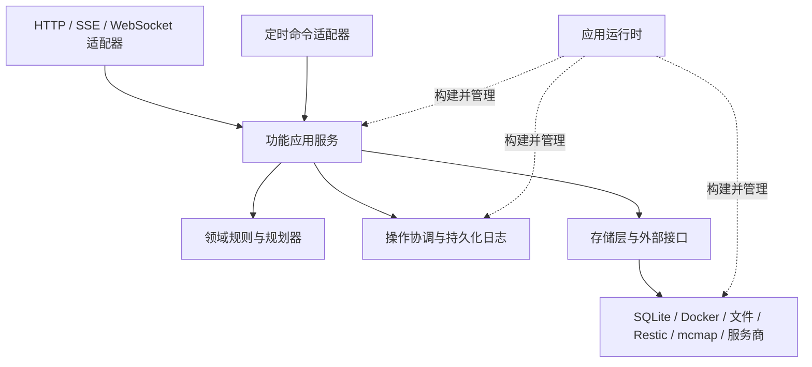

## 背景

目标和范围见[提案](proposal.md)。本文记录重构的评审基线和设计决策；当前实现见各组件设计文档，实施进度及验收边界见[任务清单](tasks.md)和[第 7 组验收记录](phase-7-review.md)。

本次评审沿用户流程检查了创建与配置、启动/停止/重启/删除、文件与上传、备份/恢复/裁剪、玩家、调度、DNS、认证和健康报告，同时覆盖应用启动、测试夹具、CI 及镜像发布。结论基于版本 `9cf6f77` 的源码和现有组件文档；文中行号对应该版本，实施过程中会发生变化。

相关的现有设计文档：

- 后端：[服务器](../../../backend/docs/servers.md)、[模板](../../../backend/docs/templates.md)、[快照](../../../backend/docs/snapshots.md)、[世界恢复](../../../backend/docs/world-restore.md)、[裁剪](../../../backend/docs/chunk-prune.md)、[后台任务](../../../backend/docs/background-tasks.md)、[玩家](../../../backend/docs/players.md)、[定时任务](../../../backend/docs/cron.md)、[DNS](../../../backend/docs/dns.md)、[自检](../../../backend/docs/self-check.md)及[数据库迁移](../../../backend/docs/database-migrations.md)。
- 前端：[数据架构](../../../frontend-react/docs/data-architecture.md)、[文件](../../../frontend-react/docs/file-management.md)、[任务中心](../../../frontend-react/docs/task-center.md)、[世界恢复](../../../frontend-react/docs/world-restore-page.md)、[裁剪](../../../frontend-react/docs/chunk-prune-page.md)及[上传](../../../frontend-react/docs/archive-upload.md)。
- 验证：[E2E 架构](../../../e2e/docs/architecture.md)及[覆盖说明](../../../e2e/docs/coverage.md)。

### 已有的合理设计

保留一体化部署、独立于可变来源模板的模板快照、纯配置准备逻辑、生命周期补偿、Restic 恢复规划和忽略路径、安全快照、世界选择范围几何算法、类型化 mcmap 事件、服务商接口、类型化 cron 注册，以及日志/RCON 校准。保留基于 Query 的服务端状态管理、统一查询键约定、由 URL 管理的导航状态、上传控制器、共用地图覆盖层及中文用户文案。

Go API 执行器已经具备明确归属的环境、资源清理、有时限的执行阶段、race 测试及实质性的副作用断言。现有取消测试能够证明子进程在发布终态前完成清理，尤其值得保留。主要问题在于不同功能之间的职责归属和规则执行不均衡，并非缺少结构或测试。

### 证据和优先级

P1 表示应在迁移相关破坏性流程前处理；P2 表示在对应阶段处理的结构债务、正确性或可用性问题。隔离复现证明的是列出的实现缺陷，不代表已经观测到生产事故。静态发现确认了代码执行路径，但不代表完成了浏览器或 Docker 复现。

| 编号 | 优先级 / 证据 | 用户影响及源码位置 |
| --- | --- | --- |
| R1 | P1，静态确认 | `backend/app/routers/servers/operations.py:56` 为手动启动加锁，但 `backend/app/servers/rebuild.py:39` 的重建直接调用 down/写入/up，`backend/app/cron/jobs/restart.py:24` 的定时重启也直接调用实例。并发入口未共用同一维护不变量。 |
| R2 | P1，静态确认 | `backend/app/servers/lifecycle/primitives.py:40` 在等待任务结束超时后只记录日志并返回，随后 `orchestrators.py:179` 继续删除文件。依附请求执行的恢复也不在任务管理器的活动任务列表中。因此，尚未确认写入结束就可能继续删除。 |
| R3 | P1，隔离 SQLite 复现 | `servers/restart_schedule.py:56` 选择名称搜索的首个结果，而 `cron/crud.py:65` 使用子串匹配。存在较新的 `restart-survival2` 时，查询 `restart-survival` 会选错计划。GET/暂停/恢复/删除使用相同模式。 |
| R4 | P1，隔离并发 SQLite 复现 | `players/crud/player_session.py:29` 先查询再插入，`models.py:250` 没有未结束会话的唯一性约束。两个数据库会话在各自 SELECT 后同时放行，会为同一组合建立两条未结束记录，导致可能重复统计。 |
| R5 | P1，静态确认 | `ServerFiles.tsx:272` 提交保存后立即清空编辑器；`FileEditDialog.tsx:130` 允许在初次加载期间保存。保存失败会丢失本地草稿，过早保存可能写入尚未初始化的内容。同时仍需支持用户有意清空文件。 |
| R6 | P1，静态确认 | `ServerCompose/DirectMode.tsx:75` 在查询内容变化时替换草稿，第 81/121 行的比较/提交会重新获取数据。用户比较配置时，远端变化可能覆盖尚未保存的配置。 |
| R7 | P1，隔离故障注入复现 | `backend/tests/snapshots/test_time_restriction.py:110` 只打印失败检查并返回，没有断言。将待测限制函数替换为“始终允许”后，会打印 12 个失败结果，但 pytest 仍报告通过。单看测试数量会高估保障能力。 |
| R8 | P1，已确认日志路径 | `backend/app/db/database.py:12` 固定开启 SQL echo；`dynamic_config/manager.py:161` 将动态配置值作为 SQL 参数持久化。服务商凭据可能通过 SQL 日志绕过审计脱敏。 |
| R9 | P2，静态确认 | 重建后的缓存失效由已挂载且打开的 `RebuildProgressDialog.tsx:35` 负责；`useServerQueries.ts:156` 将 Compose 查询视为有效达十分钟。切页后完成的操作缺少应用级状态同步负责人。 |
| R10 | P2，静态确认 | `frontend-react/src/utils/api.ts:76` 将请求错误转为 `{message,status,code}`，但 `useFileMutations.ts:30` 和 `useServerQueries.ts:81` 仍读取 Axios 错误字段，导致消息和重试行为不一致。`ServerFiles.tsx:353` 把不抛异常的刷新失败当成成功。 |
| R11 | P2，架构风险 | 通用任务保存在进程内（`background_tasks/manager.py:25`）；恢复历史会持久化，cron 结果在执行后插入，预览产物另有归属。`main.py:65` 只接入了部分关闭路径。失败和重启行为因入口而异。 |
| R12 | P2，静态确认 | `chunk_prune/service.py:119` 复用预览时捕获的领地信息，并重新按阈值选择目标；元数据和领地文件缺少统一的过期与释放机制。预览并不是冻结的删除清单。清除通用任务不会清除功能元数据。 |
| R13 | P2，可用性风险 | `dns/router.py:115` 先删除全部路由再添加期望路由；`cron/manager.py:175` 在向调度器注册前就持久化启用状态。副作用之间的失败可能导致期望状态与实际状态不一致。 |
| R14 | P2，已验证的测试/CI 缺口 | 按名称筛选“无 Docker”测试时仍会选中删除固定容器的测试（`tests/test_instance.py:17`、`tests/fixtures/test_utils.py:53`）；后端 CI 手工维护目录矩阵；镜像发布独立构建和推送，没有测试依赖门槛。 |

以下额外调查项不作为已确认漏洞呈现：`MCInstance` 使用不受约束的字符串构建根路径（`minecraft/instance.py:88`），底层文件路径限制只检查传入的基准路径。需要集中校验受管身份和根目录，并通过隔离测试确认编码路径和符号链接行为。同样，在声称已复现重复服务器缺陷之前，还需对创建和端口分配进行并发行为验证。

大文件是症状，不是验收标准：世界恢复实现有 1,078 行，裁剪、恢复、文件页面分别有 937/739/697 行。部分共用地图图层文件只是重新导出现有实现，这是过渡期的职责归属债务，并非重复算法。

## 目标与非目标

**目标：**

- 为每条不变量、状态转换、事务和清理责任明确唯一负责人。
- 新领域操作可以复用协调机制，无需修改所有路由和页面。
- 让业务测试依赖稳定用例和外部接口，在模块搬迁后仍然有效。
- 保留用户部署、数据、集成、导航、权限，以及各操作原有的取消行为。

**非目标：**

- 不为每个函数建立接口，不引入通用仓储框架、通用状态机语言或事件溯源重写。
- 不自动重启或续跑已中断的破坏性操作，不统一要求停服，也不将无关服务器的操作全局串行化。
- 不用内部异步事件总线代替必要的执行顺序。现有公开事件消费者保留原契约。

## 设计决策

### 1. 采用按功能明确归属的模块化单体

保留当前部署方式和核心库。依赖基础设施的操作发生在同一宿主机上，协调的是同一文件系统、Docker daemon 和 SQLite 数据库。将它们分布式化会引入网络及运维故障模式，而不能解决已发现的职责归属问题。

概念层面的模块划分如下。名称用于指导迁移，不强制套用统一目录模板。

| 模块 | 负责内容 | 依赖的公开边界 |
| --- | --- | --- |
| identity | 用户、会话、角色、授权策略 | 持久化及签名/时钟适配器 |
| servers | 受管服务器身份、运行意图、创建/接管/删除 | 配置、操作协调、Docker、存储层 |
| configuration | Compose/模板准备、保留的来源快照、带版本的配置应用 | 服务器引用、文件、Docker；由本模块负责配置应用流程 |
| files / archives | 受限路径、可编辑文件、搜索、上传会话、压缩包发布 | 文件系统/进程适配器及操作协调 |
| backups | Restic 快照、忽略规则、覆盖范围和恢复计划 | Restic 接口及受控服务器路径 |
| world | 布局/选择范围、局部恢复/回滚、裁剪、地图展示数据 | 备份、mcmap 接口、操作协调 |
| players | 身份解析、会话/聊天/成就、跟踪 | 服务器引用、日志/RCON 及外部玩家资料适配器 |
| automation | 计划注册与执行、受管重启绑定 | 公开命令服务；不直接调用原始 Docker 修改操作 |
| connectivity | DNS/路由的期望状态和状态协调 | 只读服务器/配置视图、服务商适配器 |
| health / settings | 当前检查与保留的发现；运行时配置 schema | 公开读取契约；不隐藏生命周期副作用 |
| operations | 准入、资源占用、取消/收尾、操作日志 | 各流程提供的策略；不包含世界/模板算法 |

传输层路由负责认证、校验、调用用例及映射结果。用例负责必要的执行顺序和事务边界。外部适配器负责 Docker/Restic/mcmap/文件系统/服务商协议。小型领域函数可以继续使用普通函数；只有外部 I/O 和确实需要替换的依赖才建立接口协议。



在 CI 中执行少量明确的导入规则：领域代码不导入路由，跨功能调用方使用公开 API，基础设施不反向依赖展示层。逐步将现有 SQLAlchemy 表和请求/响应类型迁入所属功能；在导入迁移完成前，保留兼容导出及明确的 Alembic 元数据统一注册入口。避免一次移动所有文件。

考虑过仅拆分大文件的方案，但它保留了相同的隐式依赖关系，不能充分解决问题。也无需完整重写，现有规划器、适配器和用户流程已经承载了有价值的业务语义。

### 2. 将身份与名称、路径分离

引入经过解析的服务器引用，包含持久化的服务器实例代次、公开服务器 ID 以及受限的项目/数据路径。公开的名称式 URL 保持不变；延迟执行的任务保留解析时的实例代次，避免服务器删除并重建后，旧任务转而操作新实例。接管/导入是明确的流程，不因路径存在就隐式发生。

在解析时统一校验服务器 ID 和根目录限制，包括符号链接；不能随意新增命名正则，追溯性地禁止原本安全的历史名称。已有无效或存在歧义的条目需给出可操作的诊断及明确恢复路径。文件操作保留当前针对符号链接自身执行 unlink/rename 的语义。

受管重启计划稳定绑定到服务器实例代次和用途。使用确切的归属查询，不使用列表搜索 API。普通自定义 cron 任务仍然允许存在，包括多个重启任务；唯一性只针对服务器页面管理的计划。只有历史名称完全匹配、任务类型、参数及可用的创建/历史证据共同证明所属实例代次时，才允许回填。同名重建的服务器不能被默认绑定到旧服务器的暂停任务。存在歧义时停止迁移该绑定，不选择较新的子串匹配结果。

恢复历史也需要相同的实例代次绑定。保留旧记录及快照引用，但回滚前必须验证归属。若历史名称/路径不足以确定目标实例代次，则展示历史和可处理的归属歧义，不悄然恢复到新服务器。

玩家未结束会话的唯一性由数据库和原子应用操作共同保证。保留所有已有历史 ID。在副本上预检重复未结束会话，保留修复审计记录，不悄然重算无关的已结束历史会话。修复策略选择一个有效的未结束时间区间，并协调冗余未结束记录以避免重复统计；对已部署数据库执行会修改数据的修复前，应审核具体报告。

考虑过增加 UI 校验或仅使用 Python 锁，但两者都会漏掉 cron/日志生产者，也无法从数据层杜绝非法身份关系。

### 3. 集中管理准入和资源占用，业务逻辑由各模块负责

所有入口调用同一命令服务。每个命令声明目标实例代次、受影响资源、冲突策略、取消边界、必要收尾步骤及恢复策略。实际修改前，在取得资源占用权后再次解析和检查；预检仍有助于用户体验，但不承担最终安全边界。

以现有每服务器进程内互斥锁为起点，增加明确的准入和等待任务结束状态。支持的部署形式是单进程协调。按确定顺序获取多个服务器范围的占用权。为端口分配设置范围有限的分配保护，不将所有操作全局串行化。

嵌套步骤复用内部资源租约上下文，其已声明资源必须覆盖子步骤工作。恢复创建安全备份时，不能递归获取同一个不可重入服务器锁。该上下文由协调代码创建，不接受客户端传入；子步骤不能扩大资源范围或绕过校验。执行前声明所需资源类别的并集，并对分配资源和服务器资源使用统一获取顺序。如果后续规划发现额外资源，应释放资源后重新规划，不能以不一致顺序升级已持有的锁。

| 操作关系 | 拟采用规则 |
| --- | --- |
| 恢复/裁剪与 start/up/restart/重建 | 相互排斥；手动操作冲突按现有约定拒绝，定时操作冲突记录为跳过 |
| 备份与现有维护/启动冲突 | 保留当前锁语义和全局备份的受影响服务器解析；继续支持在线备份 |
| 删除与删除范围内的任何写入 | 冻结新操作准入，取消并等待可取消任务结束，确认所有占用方结束后再删除；超时则中止删除 |
| 普通文件恢复/编辑/上传 | 保留当前在线可用性；只拒绝与已占用的破坏性操作范围发生冲突的操作 |
| 独立服务器和安全读取 | 继续并发执行，不持有全局读锁 |
| 地图渲染与世界写入 | 保留既有安全读取；操作收尾在释放必要资源占用权前，使受影响瓦片失效 |

删除操作不能持有执行锁，同时等待必须取得该锁才能结束的任务。将准入门槛与活动执行的资源占用分开，让排队任务能够响应取消；在互斥锁外等待任务结束，随后获取删除所需的独占权并再次检查。参与者包括恢复流、数据填充、所有权修复、上传写入和重建，不仅是任务管理器里的任务。

不将此机制扩展为通用资源调度框架。只有已支持流程需要不同并发规则时才新增资源类别。正确行为由验收矩阵定义，不由函数所在位置决定。

### 4. 分离执行生命周期、持久化结果和进度传输

使用统一的内部操作术语，通过适配器保留现有任务状态字符串、cron 状态、恢复历史和 SSE 事件。内部区分 queued/running/cancelling/finalizing，以及 succeeded/failed/cancelled/interrupted/skipped 等终态。现有客户端无需解析新枚举值：增量操作日志数据承载更丰富的结果，旧适配器将中断映射为现有失败表示，并提供清晰提示。

操作日志保存精简的标识符、执行者、阶段、时间戳、适用时的运行意图/配置版本、结构化失败及恢复引用，以及受影响资源。进度在内存中合并；在受理、关键阶段边界和终止时持久化。不逐条持久化地图事件、秘密、原始请求体或大型几何数据。

| 执行归属 | 示例 | 必须保留的行为 |
| --- | --- | --- |
| 后台任务 | 重建、压缩、数据填充、裁剪 | 切页后继续；以状态查询为准 |
| 请求/流 | 当前恢复/回滚及预览流 | 断连结束执行，并按现有契约记录中断 |
| 浏览器传输 | 下载、文件上传 | 不能仅因元数据持久化，就宣称丢失 JS 执行状态后仍能继续 |
| 预览会话 | 世界预览、裁剪输入 | 明确过期、引用及产物清理 |

执行器直接向适配器提供取消机制，不把进度 yield 作为唯一取消检查机会。成功或已取消终态必须在所属写入结束及必要清理完成后发布。无法确认写入停止时，记录中断及原因并保留受影响范围的恢复阻断；旧任务接口通过失败状态投影这一结果，不永久停留在正在取消，也不解除冲突写入限制。取消不承诺回滚，保留各流程现有的部分输出和安全快照语义。

启动时，在调度新修改或开放写入前处理操作日志。中断的破坏性操作不自动重试。只有适配器能够确认实际状态时才据此判断，否则报告不确定性和恢复选项。对子进程身份的跟踪应足够可靠，避免将复用 PID 的进程误认为原写入任务。父进程退出本身不能证明所有外部写入都已停止。无法证明写入结束时，为受影响资源保留可见的恢复阻断；验证或结束所属写入任务后才能解除。其他服务器和安全读取仍可使用。

确认写入已经结束后，要区分“已知的部分数据修改”与“未知的执行占用状态”。保留现有世界安全快照恢复选项，在操作不变量允许时支持用户明确选择继续管理，不强制每次恢复失败都必须回滚。配置文件与来源元数据不一致时，需要协调状态或明确选择权威版本。缓存失效失败时，将缓存标为不可用或变更缓存代次，防止读取过时内容，同时避免无限期占用整台服务器。明确展示解除剩余阻断所需的动作，并审计解除过程。普通文件恢复记录现有安全快照，不凭空承诺文件系统原子回滚。

临时产物由所属功能登记和管理，在没有活动引用后，通过完成、过期或明确关闭记录等时机释放。持久化操作历史、用户关闭显示记录与删除活动资源是不同动作。终态记录设置有界保留策略，尚未解决的恢复引用保留到明确解决为止。长生命周期状态由运行时管理，并具有关闭路径。

裁剪预览需要输入版本：绑定服务器实例代次、阈值/模式、世界文件清单或代次，以及领地摘要。应用管理的写入会使该版本失效。应用前，在取得维护占用权后重新检查实时输入，拒绝过期预览。当前 mcmap 会重新按条件选择目标，并非应用冻结选择范围；在适配器层验证受支持的稳定输入前，不承诺预览与应用完全一致。若需要 mcmap 提供清单式执行契约，应明确划定后续工作范围；仅有元数据无法保证任意外部文件系统写入的安全性。

考虑过将所有进度流程改成后台任务，但这会改变断连和取消语义，因此不采用。带操作日志的单进程执行也不需要引入 Celery/Redis。

### 5. 明确数据库、文件系统与外部系统的一致性边界

在应用边界内使用短数据库事务。存储层默认执行 flush 并返回，不让每个辅助函数隐式提交部分流程；旧辅助函数在迁移前继续通过封装使用。等待 Docker、Restic、长时间文件复制或 DNS 时，不持有 SQLite 写事务。

配置准备生成不可变的渲染内容、来源快照/变量、基准版本及运行意图。应用配置按操作日志记录的顺序执行：解析并检查版本和占用权、准备暂存内容、按需停服、在同一文件系统上原子替换内容、持久化匹配的来源元数据、恢复原运行意图。各阶段前后的标记用于诊断文件替换与元数据提交之间的崩溃。不承诺跨 SQLite 和 Docker 的原子事务。

版本感知保存采用增量扩展：随应用提供的 UI 提交预期内容版本，版本变化时收到冲突。在兼容支持期内，不提供版本的旧客户端保留当前最后写入生效的行为，同时仍遵循操作串行化规则。哈希/版本检查覆盖由应用管理的写入；应用之外的任意编辑需要重新校验，并作为明确的运行限制保留。

区分主要操作成功与后续状态协调失败。保留现有生命周期操作后尽力更新 DNS 的行为，但展示待同步或降级的连接状态，并对安全的状态协调安排重试。先生成 DNS/路由差异，再增量应用，避免清空无关路由。读取服务商失败表示状态未知，不等于期望列表为空。保留文档中已有的空期望状态删除策略，除非另行批准行为变更。

Cron 继续作为触发适配器。持久化执行开始和终态，明确区分已配置状态与实际注册状态，在启动时协调，并将有意不执行记录为跳过。主要修改后发生崩溃，不能靠盲目重新执行 cron 任务来修复。

默认 SQL 日志必须隐藏参数；统一异常映射，提供中文用户提示、稳定错误码和诊断关联信息。保留现有传输错误结构和有意义字段，不承诺历史文案逐字不变。虽然通用处理器返回 detail 字符串，压缩包偏移冲突使用包含 message/offset 的对象；迁移前还需盘点其他受支持的结构化和校验错误。前端归一化应在提取显示消息时保留结构化详情。不向 UI 或历史记录输出原始 URL、凭据、子进程环境或异常堆栈。

### 6. 由应用运行时管理资源

在应用工厂或运行时中构建服务，向用例传入稳定依赖。FastAPI 依赖访问器向路由提供运行时；测试构造独立运行时。采用显式构建，不引入依赖注入框架。

先初始化迁移和配置，协调中断操作，再启动 cron、玩家监控等生产者。使用清理栈，在部分启动失败时逆序清理已经创建的资源。关闭时先停止接收新操作，再停止生产者并按策略等待所属工作结束，关闭渲染队列、预览管理器、服务商客户端，最后释放数据库资源。若进程被强制终止而无法清理，恢复记录仍需如实反映状态。

当前单例导入可暂时通过兼容外观层委托给运行时管理的实例。所有生产者和测试迁移后，再移除对应外观层。在有助于确定性并发和故障测试的位置注入时钟、ID 和进程接口。

FastAPI 文档中的[生命周期管理](https://fastapi.tiangolo.com/advanced/events/)及[测试依赖覆盖](https://fastapi.tiangolo.com/advanced/testing-dependencies/)支持这一构建边界；本方案不要求替换 FastAPI。

### 7. 围绕用户流程组织前端功能

目标结构：

```text
src/app/                 路由、提供器、会话、操作观察器
src/shared/              UI 基础组件、传输、查询策略、编辑器基础界面
src/features/
  servers/               运行状态与生命周期命令
  configuration/         Compose/模板编辑、比较、重建
  files/                 浏览、搜索、编辑会话、文件上传
  archives/              压缩包存储、断点上传、发布
  backups/               快照与普通文件恢复
  world/                 维度、地图、领地/玩家覆盖层
    restore/             选择、预览、恢复、回滚
    prune/               参数、预览、受保护的应用操作
  tasks/                 操作观察与结果展示
  players/ schedules/ dns/ self-check/ settings/ users/
```

各功能按需集中放置契约、API 函数、查询选项、命令、状态及 UI。小功能不必建立六个空目录。页面负责组合功能和路由参数，控制器负责复杂流程状态，纯几何/选择函数不依赖 React。共用地图代码归 world 所有，不通过重新导出依赖恢复功能内部的实现。

继续以 TanStack Query 作为服务端状态来源。查询选项工厂同时供单个 hook 和聚合 `useQueries` 使用，避免复制重试和轮询策略。Zustand 负责本地偏好及确实需要跨页面共享的临时选择状态。不仅为统计活动任务数量就维护第二份可写任务镜像。

编辑会话持有基准内容、草稿、远端版本、加载/保存状态和冲突状态。远端刷新更新比较中的远端一侧，不覆盖已修改草稿。只有保存成功或用户明确丢弃时才清空编辑内容。加载失败禁用保存，但已成功加载后用户有意清空的草稿仍然有效。冲突处理允许用户获取并比较远端版本，明确保留或合并内容，再基于观测到的版本重新提交；再次竞争仍报告冲突。保留原始编辑、语言识别、差异对比、模板转换，以及现有文件 URL、搜索和覆盖范围行为。

应用级操作观察器跟踪已提交或从后端发现的操作及其终态转换。每种操作通过小型注册表提供受影响资源键。无论发起页面是否存在，完成或可能产生部分写入的失败都应对相应范围的查询键执行一次失效。重连时重新同步活动操作和终态结果，并保守处理可能受影响的范围；初版可以继续轮询，无需新增推送总线。退出登录时清理会话范围的观察器和缓存。

将 HTTP 和有限流的失败归一为同一套类型化错误契约，下游代码不再读取隐藏的 Axios 字段。向重试和 UI 策略保留服务端消息及状态。区分未授权与会话查询临时失败，并显式检查重新获取数据的结果。TanStack 文档说明了[单次 mutation 回调的生命周期限制](https://tanstack.com/query/latest/docs/framework/react/guides/mutations)；操作完成处理不能依赖组件持续挂载。

只有验证响应 schema 后才逐步生成 DTO 类型；不假定当前 OpenAPI 已描述所有字典、SSE 和结果联合类型。在边界保留领域视图转换及手写流校验器。全面替换为生成客户端不是前置条件。

### 8. 在能够有效证明行为的最低层级测试

| 层级 | 目的 | 真实依赖与隔离方式 |
| --- | --- | --- |
| 领域 | 选择/覆盖范围、配置准备、冲突策略、状态转换 | 纯输入；对边界较多的算法使用属性测试或表驱动测试 |
| 应用服务 | 完整用例、事务/收尾顺序、并发不变量 | 真实临时 SQLite 和文件；受控 Docker/服务商/进程接口；使用同步屏障，不靠 sleep 猜测时序 |
| 适配器契约 | Docker/Restic/mcmap/文件/流语义 | 按能力标记的真实二进制或归属明确的容器；CI 固定版本 |
| 前端集成 | 草稿、错误、真实 Query 缓存、导航与操作交互 | 真实 QueryClient 和 UI；替换 HTTP 边界，不 mock 掉所有 hook |
| Go API E2E | 已部署镜像的业务结果、认证、世界内容、重启恢复 | 保留现有管理自有环境的执行器，并继续与路由访问审计区分 |
| 浏览器用户流程 | 跨路由和组件的用户交互 | 在归属明确的应用环境上运行小型 Playwright 测试集 |

保留已有优质测试，逐步把与导入路径耦合的 patch 迁移到稳定接口。优先修复只打印失败而没有断言的测试。对少量关键不变量注入已知错误行为，确认对应测试确实失败；这是有针对性的断言验证，不设置新的全局变异测试分数目标。

用能力标记（单元/服务、文件系统、二进制、Docker、服务商）替代文件名启发式筛选。每个测试拥有明确归属的应用/运行时、数据库、临时根目录、服务器/容器命名空间、时钟及清理职责。测试不得删除不是由自己创建的固定名称容器。审计 CI 测试收集集合与分片并集，避免新增目录被静默漏测；在证明夹具归属与隔离之前，不大范围启用并行 pytest。

迁移一个流程前的最低回归矩阵：

| 用户不变量 | 所需证据 |
| --- | --- |
| 世界维护覆盖所有冲突入口 | 手动、重建、cron、数据填充、删除的交错执行；再次检查停服状态；嵌套安全备份不死锁；全局备份与删除冲突 |
| 删除等待操作真正结束 | 生成器/流/进程停滞、取消超时、并发提交；删除被拒绝时文件仍保留 |
| 服务器计划和恢复目标正确 | 名称前缀相似、显示名称变化、独立自定义任务、删除重建、存在歧义的旧计划/恢复引用 |
| 玩家会话唯一 | 并发上线、重复离线、重启恢复、准确时长断言 |
| 草稿不悄然消失 | 加载延迟/失败、保存失败、远端变化后的比较、有意清空文件、版本冲突 |
| 用户看到实际操作结果 | 离开/返回页面、部分失败/取消/中断、重复轮询、退出/重新登录、流提前 EOF |
| 预览与应用的资源归属 | 领地/世界输入变化、重复提交、过期预览、取消和产物清理 |
| 现有数据可升级 | 新建数据库，以及由受支持的实际发布版本生成的脱敏夹具；不能只依赖从当前模型降级的数据库 |
| 错误和隐私契约 | 401/403/409/422/5xx、断网、SSE 终止、所有相关日志均不出现服务商秘密 |

增加小型浏览器测试集，覆盖文件编辑失败与重试、Compose 比较与冲突、跨页面重建、恢复预览/中断/回滚的可见性、裁剪预览过期，以及会话和控制台重连。复用 API 夹具准备状态，避免在浏览器中复制完整 Go 测试集。Playwright 的[隔离浏览器上下文](https://playwright.dev/docs/browser-contexts)及[自动等待式断言](https://playwright.dev/docs/best-practices)适合这些流程。

路由访问量、行覆盖率、测试数量和文件长度仅用于诊断，不作为发布验收条件。验收要求可观察结果保持兼容，且不存在无法解释的失败或不稳定场景。迁移前后测量请求/轮询数量，以及有代表性的地图、上传和备份延迟；根据证据需要扩展测试或性能分析。

## 风险与取舍

- 【中央协调器变成另一个庞大模块】→ 它仅负责准入和生命周期；领域策略及流程保留在各功能命令中。优先使用小型明确策略表，不提供任意阶段的通用回调框架。
- 【统一交互改变取消行为】→ 保留执行归属模式及旧协议适配层，将断连和部分写入测试作为发布门槛。
- 【将操作日志误认为可防崩溃的事务】→ 持久化阶段及恢复证据，记录存在歧义的崩溃窗口，不仅凭执行意图推断成功。
- 【锁掩盖不受支持的多 worker 部署】→ 保持单后端写入进程，增加明确的部署校验，不声称内存锁可以协调多个副本。
- 【数据库修复损坏历史】→ 在副本上预检，保留修复证据，不重写无关历史；绑定不明时停止，并演练数据库快照恢复。
- 【新抽象降低吞吐量】→ 使用短事务、按服务器/资源加锁、合并进度、有界产物管理，并与基线实测比较。
- 【服务商故障阻止本地管理】→ 必要核心初始化失败时清晰报错；可选网络连接功能报告降级并安全协调，不改变生命周期操作成功语义。
- 【大规模搬迁掩盖回归】→ 迁移完整纵向流程，将行为修复与文件移动分开，保留临时适配层并列出明确移除任务。
- 【保留策略删除恢复材料】→ 将尚未解决的恢复引用，与可关闭的任务展示记录及普通终态历史过期分别处理。

## 迁移计划

本次是较大规模重构，按可独立验证的阶段交付，无需一次性切换整个仓库。

| 阶段 | 工作及可评审产物 | 阶段验收条件 |
| --- | --- | --- |
| 0. 建立可信基线 | 盘点用户契约、权限和协议；修复假绿测试及不安全夹具；记录数据/API/二进制行为参考基线 | 人为注入故障时关键测试会失败；夹具归属明确；已记录现有基线 |
| 1. 在现有入口保障正确性 | 精确计划定位、会话不变量、草稿保留、错误契约、SQL 隐私、当前维护/删除漏洞 | R1–R8/R10 有回归证据；用户流程保持兼容 |
| 2. 引入运行时和操作边界 | 应用工厂/生命周期；准入/取消/收尾；精简操作日志；旧接口适配层 | 启动/关闭/中断和全入口冲突矩阵通过；不存在归属不明的写入 |
| 3. 端到端试点配置流程 | 准备/应用边界、来源与版本一致性、前端编辑会话、全局完成同步、精确受管计划绑定 | 编辑 → 比较 → 应用 → 切页 → 返回；启动/元数据故障及旧 API 测试通过 |
| 4. 迁移文件、备份和世界 | 保留规划器；按需要提取不同恢复范围的策略；绑定裁剪预览与产物；复用世界/地图 UI | 文件/恢复/裁剪内容、忽略规则、取消、回滚、预览新鲜度及锁测试通过 |
| 5. 完成功能边界 | 玩家、cron、连接状态协调、健康/设置/身份；功能 DTO/模型归属；移除单例及内部导入兼容层 | 原有角色/服务商/历史语义通过；架构规则成立；数据迁移演练通过 |
| 6. 完成验证与交付 | 浏览器流程、测试集合审计、固定产物测试、同 digest 发布、当前状态文档 | 已验证镜像可部署，并可在文档规定的兼容窗口内回滚 |

阶段 1 的修复应小而可独立评审；阶段 2 将其共用策略归入同一负责人，不额外叠加一层检查。数据库增量结构变更只在某个迁移单元实际需要时引入。每个阶段都包含自己的测试和文档；阶段 6 补齐跨领域缺口，不将所有测试推迟到最后。

上线规则：

1. 在可丢弃副本上保存受支持发布版本的数据库及配置/文件基线。不以 `create_all` 或重置作为已部署安装实例的迁移策略。
2. 先新增表和可空归属字段。执行回填、预检并验证不变量后，再施加唯一性约束。区分普通 cron 任务和受管计划。
3. 通过既有适配器切换流程，副作用始终只有一个执行负责人；不得为比较而同时执行两套破坏性命令。仅对纯规划器或只读投影做影子比较。
4. 迁移窗口内保留兼容读取和旧 API 结构。代码上线失败时，先停止新操作准入、等待运行中工作结束，再回退到已验证兼容该 schema 的程序版本。数据库恢复属于受控恢复，不能自动覆盖新产生的用户数据来回滚。
5. 破坏性世界修改继续遵循自身的安全快照和恢复策略；应用代码回滚不会撤销世界写入。
6. 对应提交的全部门槛通过后，按 digest 发布经 E2E 测试的候选镜像，将源码版本、测试证据和 digest 一并记录。

每个实现阶段落地后，更新根目录和对应范围的 `CLAUDE.md` 及当前状态组件文档。在迁移任务中心/下载功能时，修正现有过时文档。实现前不要把拟议布局描述为当前架构。只有实现经过验证、变更准备归档时才同步行为规范。

## 本次评审验证结果

本次评审没有部署应用、实际操作浏览器、执行真实 Docker/API E2E 或联系 DNS 服务商；静态发现不能视为已完成上述验证。

以下验证完成于 2026-09-19：

- 后端隔离基线：**1,608 项通过，62 项未选中，5 条警告**，耗时 581.50 秒。命令：`uv run --no-sync pytest tests -k 'not _with_docker and not integrated and not test_minecraft_instance' -o addopts='' -p no:cacheprovider -q`，使用独立临时配置、数据库、服务器根目录、静态文件根目录和日志。额外排除项用于避免 R14 所述固定容器清理。警告为一条测试类收集提示及四次预期的已弃用字段访问。由于仍有假绿测试，通过结果不能证明所有声称的业务保障均有效。
- 后端静态基线：`uv run --no-sync pyright` 通过，零错误、零警告；`uv run --no-sync ruff check .` 通过。Pyright 版本更新提示属于工具信息，不是代码诊断。
- 前端：`pnpm lint`、`pnpm typecheck`、`pnpm test` 通过，**6 个测试文件 / 12 个测试**。本地 Node 为 26.1.0，会触发项目要求 Node 24 的引擎版本警告，因此不能替代固定 Node 24 的 CI 门槛。pnpm 为 11.0.9。
- Go：使用 go.mod 固定的 **Go 1.27.1**，仅安装在临时评审目录中；`make check` 通过，包括格式、`go vet` 和启用 race 检测的测试，共九个包包含通过的测试。验证对象是执行器，不是其部署后的回归场景。
- 隔离复现：计划错选、并发重复玩家会话，以及备份限制假绿测试。均使用临时状态，未修改项目源码或生产数据。
- 本地外部二进制版本为 fd 10.3.0 / Restic 0.18.0 / mcmap 0.8.4，CI/镜像版本为 fd 10.4.2 / Restic 0.18.1 / mcmap 0.8.4。真实镜像验证仍属于实施验收门槛。
- 本次会话没有可调用的 IDE diagnostics 工具。编译器和 lint 结果单独报告，不表述为 IDE 诊断。
- 规划文档通过 `openspec validate refactor-application-boundaries --strict`。仅新增规划目录，尚未执行实现或迁移。
